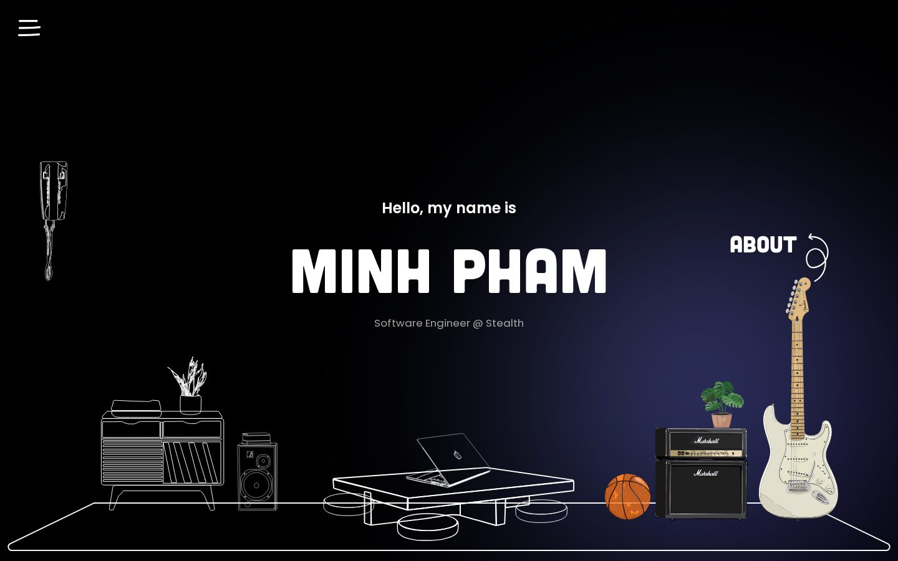

# Minh Pham — Portfolio

My portfolio is a hand-drawn room, where each piece of furniture stands for part of my life.
Everything starts as a white outline. Hover over a piece and it fills with color and a label
points to it. Click it to open that section.

| Furniture | Section |
| --- | --- |
| Record cabinet + speaker | **Projects** |
| Low table + laptop | **Work** |
| Amp, guitar + basketball | **About** |
| Wall phone | **Contact** |



Built with [Next.js](https://nextjs.org) (App Router), React and plain CSS. Panel animations use
[Framer Motion](https://motion.dev). There's also a secret game version at `/tower`; see
[The secret level](#the-secret-level-dogeking-tower).

## Running it

You need [Node.js](https://nodejs.org) 18.18 or newer.

```bash
npm install      # first time only
npm run dev      # start the dev server at http://localhost:3000
```

Other scripts:

```bash
npm run lint     # check the code for mistakes
npm run test:tower  # check the tower game's stages and simulation
npm run build    # production build (run this before deploying)
npm start        # serve the production build locally
```

## Where things live

```
app/
  layout.tsx          page <title> and description
  page.tsx            the home page (just renders MinhPortfolio)
  tower/page.tsx      the secret game (see below)
  globals.css         all styles, including the color palette at the top
  icon.png            browser-tab icon
components/
  MinhPortfolio.tsx   puts the page together: glow, menu, name, room, panels
  Room.tsx            the furniture, where each piece and its label sit, and the tower button
  SectionPanel.tsx    the slide-in panel for each section
  Navigation.tsx      hamburger menu, résumé link and social icons
  GlitchText.tsx      the scrambling "Minh Pham" title
lib/
  content.ts          ALL the words on the site: projects, jobs, about, links
public/
  resume.pdf          the résumé people download
  assets/             drawings, fonts, profile photo and the menu texture
```

## Common edits

### Change what the site says
Everything is in **`lib/content.ts`**:

- `PROFILE`: the tagline under your name and the photo in the About panel
- `ABOUT`: bio, hobbies, education and skills
- `WORK`: jobs, newest first
- `PROJECTS`: project cards
- `SOCIALS` and `CONTACT`: email, links and the Contact panel intro

To add a job or project, copy one of the existing blocks and change the text. To swap the photo,
replace `public/assets/photos/profile.jpg` with a square image around 480×480.

### Update the résumé
Replace `public/resume.pdf` with the new file, keeping the same name. The menu and the Contact
panel both link to it.

### Change the colors
Open `app/globals.css`. The palette is at the top, under `:root`:

```css
--accent: #8c9eff;        /* links, dates, highlights */
--accent-strong: #4f5bd5; /* accent on the white menu */
--accent-deep: #2a1f7a;   /* far edge of the cursor glow */
--accent-tint: rgba(34, 40, 110, 0.45); /* backdrop behind the open menu */
```

### Move a piece of furniture or its label
Open `components/Room.tsx` and edit the `SPOTS` table. Numbers are in "design pixels" of a
1440px-wide room, and the whole room scales to fit the screen, so a value that looks right at
one size looks right at every size.

- `x`, `bottom`, `width`: where the furniture sits.
- `title`, `arrow`: where the label and arrow sit, measured from the furniture's top-left corner.
  `y` is how far **above** the top edge they go.

### Swap a drawing
Each section uses three SVGs in `public/assets/`, all named after the section:

- `<section>-outline.svg`: the white line drawing
- `<section>-colored.svg`: the filled version shown on hover
- `<section>-arrow.svg`: the hand-drawn arrow

Export the outline and colored versions at the same size so they line up.

### Add a new section
1. Add its id to `SectionId`, `SECTION_ORDER` and `SECTION_TITLES` in `lib/content.ts`, then add
   its content there too.
2. Add a component that renders that content to `CONTENT` in `components/SectionPanel.tsx`.
3. Add the three drawings (see above) and a row to `SPOTS` in `components/Room.tsx`.

## The secret level: DogeKing Tower

`/tower` is a playable, Katana Zero-style version of the portfolio. The way in is the elevator
call button on the room's right wall (on phones, the "Going up?" link under your name). You play
the Headhunter, climbing a tower where every floor is one of your jobs, to reach DogeKing (you)
in the penthouse. The main room stays the real site; the tower is the surprise.

It has no game engine. Everything is TypeScript: a Canvas 2D renderer, one WebGL shader pass,
Web Audio for all sound and music, and sprites drawn in code. The plan behind it is in
[docs/tower-plan.md](docs/tower-plan.md).

**Controls:** A/D run · W or Space jump (again against a wall to wall-jump) · S roll or drop ·
click to slash toward the cursor · right click to pick up and throw · hold Shift to slow time ·
R to restart a stage · Esc to pause. Gamepads work, and phones play in landscape with touch
controls. Recruiter mode in Settings makes you invincible, and after three deaths a stage offers
a skip.

```
game/
  engine/     constants (screen size, slow-motion numbers), input, random numbers
  world/      the simulation: player, enemies, boss, bullets, stages, physics
  art/        sprites drawn from pixel skeletons and small hand-drawn grids
  render/     drawing, props, set pieces, lighting, the WebGL post pass
  audio/      synthesized sound effects and the music sequencer
  story/      floors, dialogue, the Dossier and one file of stage maps per floor
  flow/       the screens between stages, saving, keyboard/mouse/pad/touch
components/tower/   the React overlay: title, dialogue, menus, Dossier, ending
```

### Editing the tower

- **Facts:** the floors, the Dossier, the ending card and the credits all read `lib/content.ts`,
  so editing it updates the game too.
- **Dialogue:** each floor's intro and elevator ride are in `game/story/floors.ts`. A line can
  have `choices`, or an `interrupt` (the red option you can pick while it's still typing).
- **Crew quotes (floor 2):** `CREW_LINES` in `game/story/stages/command.ts`. They restate résumé
  facts for now; real quotes from teammates would be better.
- **Stages:** one file per floor in `game/story/stages/`. Each map is ASCII, one character per
  16 px tile:

  | Tile | Means | Tile | Means |
  | --- | --- | --- | --- |
  | `#` | wall or floor | `=` | platform (jump up through, S to drop) |
  | `\|` | door | `@` | where you start |
  | `$` | exit | `?` | intel file |
  | `!` | laser gate | `:` | tripwire (wakes the nearest `^` turret) |
  | `*` | something to throw | `-` | patrol range for the enemy on that row |

  Enemies are letters, lowercase facing left and uppercase facing right: `b` bouncer, `g` guard,
  `e` shotgun, `f` shield, `u` bug, `d` drone, `l` shuttlecock launcher, `k` DogeKing. Props
  (windows, lamps, signs, desks…) are listed under each stage's `props`, in tiles.
- **Music:** `game/audio/music.ts` has one synthesized track per floor. Your band's recordings
  could replace them.

### Testing it

```bash
npm run test:tower   # maps are valid and reachable, replays are exact, slow motion is 5x slower
```

`/tower?stage=test` opens a sandbox room, `/tower?floor=4` starts on a given floor, and two debug
views show the art: `/tower?debug=sprites` (every sprite frame) and `/tower?debug=stage&id=4-2`
(a whole stage).

## Small screens and touch
Below 1024px wide the room is hidden, and the sections appear as text links under the name.
Touch screens can't hover, so there the room shows every piece in color with its label.

## Deploying
The easiest option is [Vercel](https://vercel.com/new). Import this GitHub repo and click Deploy,
because it detects Next.js automatically. After that, every push to `main` redeploys the site.
