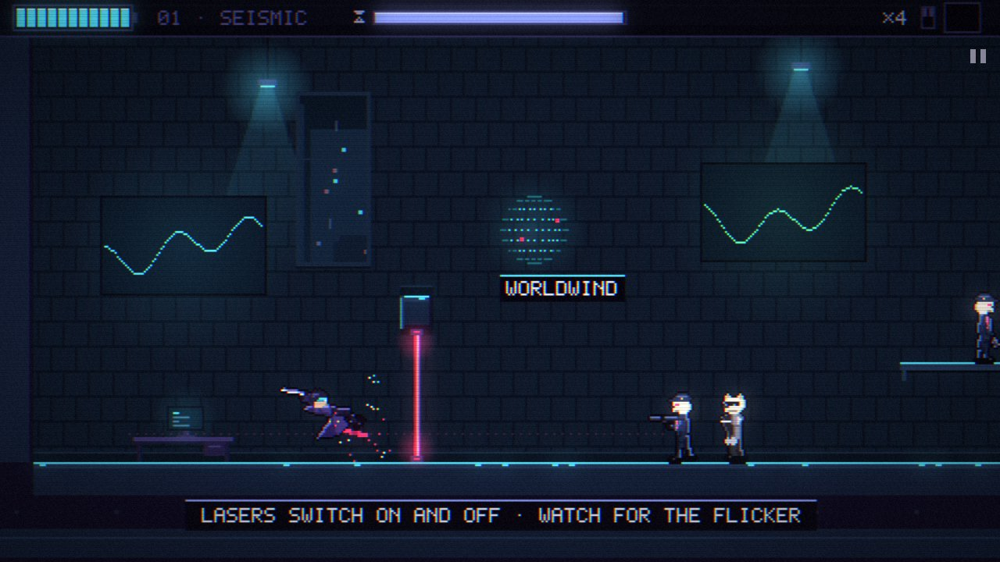

# DogeKing Tower — Minh Pham's portfolio, as a game

A Katana Zero-style climb through my résumé. You play the Headhunter, hired to find a software
engineer who goes by DogeKing. Every floor of the tower is one of my jobs, the files you recover
along the way are my portfolio, and the penthouse is my room. Guess who's waiting at the top.



The game lives at `/tower`, so the plain site ([dogekingkong.com](https://dogekingkong.com)) can
link straight to it; `/` just redirects there. Every "quit" link in the game goes back to the
plain site (`SITE_URL` in `lib/content.ts`).

It has no game engine. Everything is TypeScript: a Canvas 2D renderer, one WebGL shader pass,
Web Audio for all sound and music, and sprites drawn in code. The page around it is
[Next.js](https://nextjs.org). The original plan is in [docs/tower-plan.md](docs/tower-plan.md).

**Controls:** A/D run · W or Space jump (again against a wall to wall-jump) · S roll or drop ·
click to slash toward the cursor · right click to pick up and throw · hold Shift to slow time ·
R to go back to the last checkpoint · Esc to pause. Gamepads work, and phones play in landscape
with touch controls (held upright, they ask you to turn the phone). Recruiter mode in Settings
makes you invincible, and after three deaths a stage offers a skip.

## Running it

You need [Node.js](https://nodejs.org) 18.18 or newer.

```bash
npm install         # first time only
npm run dev         # start the dev server at http://localhost:3000
```

Other scripts:

```bash
npm run lint        # check the code for mistakes
npm run test:tower  # maps are valid and reachable, replays and checkpoints are exact, slow motion is slow
npm run build       # production build (run this before deploying)
npm start           # serve the production build locally
```

## Where things live

```
app/
  layout.tsx          page <title> and description
  tower/page.tsx      the game's page
  globals.css         fonts and a small reset
  icon.png            browser-tab icon
components/tower/     the React overlay: title, dialogue, menus, Dossier, ending, touch controls
game/
  engine/             constants (screen size, slow-motion numbers), input, random numbers
  world/              the simulation: player, enemies, boss, bullets, stages, physics
  art/                the character rig, the cast's outfits and heads, items and effects
  render/             drawing, props and furniture, set pieces, lighting, the WebGL post pass
  audio/              synthesized sound effects and the music sequencer
  story/              floors, dialogue, the Dossier and one file of stage maps per floor
  flow/               the screens between stages, checkpoints, replays, saving
lib/
  content.ts          ALL the facts: jobs, projects, about, links
public/
  resume.pdf          the résumé people download
  assets/             fonts, the profile photo and two clips for the Dossier
scripts/tower-test.ts the checks behind `npm run test:tower`
```

## Common edits

- **Facts:** the floor cards, the Dossier, the ending card and the credits all read
  `lib/content.ts`. To add a job or project, copy one of the existing blocks and change the text.
  To swap the photo, replace `public/assets/photos/profile.jpg` with a square image around 480×480.
- **Résumé:** replace `public/resume.pdf`, keeping the same name.
- **Dialogue:** each floor's intro and elevator ride are in `game/story/floors.ts`. A line can
  have `choices`, or an `interrupt` (the red option you can pick while it's still typing). The
  penthouse conversations are in `game/story/stages/penthouse.ts`, and the lines you hear when
  you die or clear a stage are at the top of `game/flow/game.ts`.
- **Crew quotes (floor 2):** `CREW_LINES` in `game/story/stages/command.ts`. Real quotes from
  teammates would beat the made-up ones.
- **Music:** `game/audio/music.ts` has one synthesized track per floor. Your band's recordings
  could replace them.
- **The cast:** outfits, colors and the pixel heads (the Doge head included) are in
  `game/art/characters.ts`; the rig that poses and shades them is `game/art/rig.ts`.

### Stages

One file per floor in `game/story/stages/`. Each map is ASCII, one character per 16 px tile:

| Tile | Means | Tile | Means |
| --- | --- | --- | --- |
| `#` | wall or floor | `=` | platform (jump up through, S to drop) |
| `%` | solid, drawn by a furniture prop | `~` | platform, drawn by a furniture prop |
| `\|` | door | `@` | where you start |
| `$` | exit | `?` | intel file |
| `!` | laser gate | `:` | tripwire (wakes the nearest `^` turret) |
| `*` | something to throw | `-` | patrol range for the enemy on that row |

Enemies are letters, lowercase facing left and uppercase facing right: `b` bouncer, `g` guard,
`e` shotgun, `f` shield, `u` bug, `d` drone, `l` shuttlecock launcher, `k` DogeKing. Props
(windows, lamps, signs, furniture…) are listed under each stage's `props`, in tiles.
`checkpoints` lists the tiles where a stage saves your progress; dying or pressing R sends you
back to the last one you passed. `time` is the stage's time limit in seconds.

### Debugging

`/tower?stage=test` opens a sandbox room, `/tower?floor=4` starts on a given floor, and two debug
views show the art: `/tower?debug=sprites` (every sprite frame) and `/tower?debug=stage&id=4-2`
(a whole stage).

## Deploying

The easiest option is [Vercel](https://vercel.com/new). Import this GitHub repo and click Deploy,
because it detects Next.js automatically. After that, every push to `main` redeploys the site.
